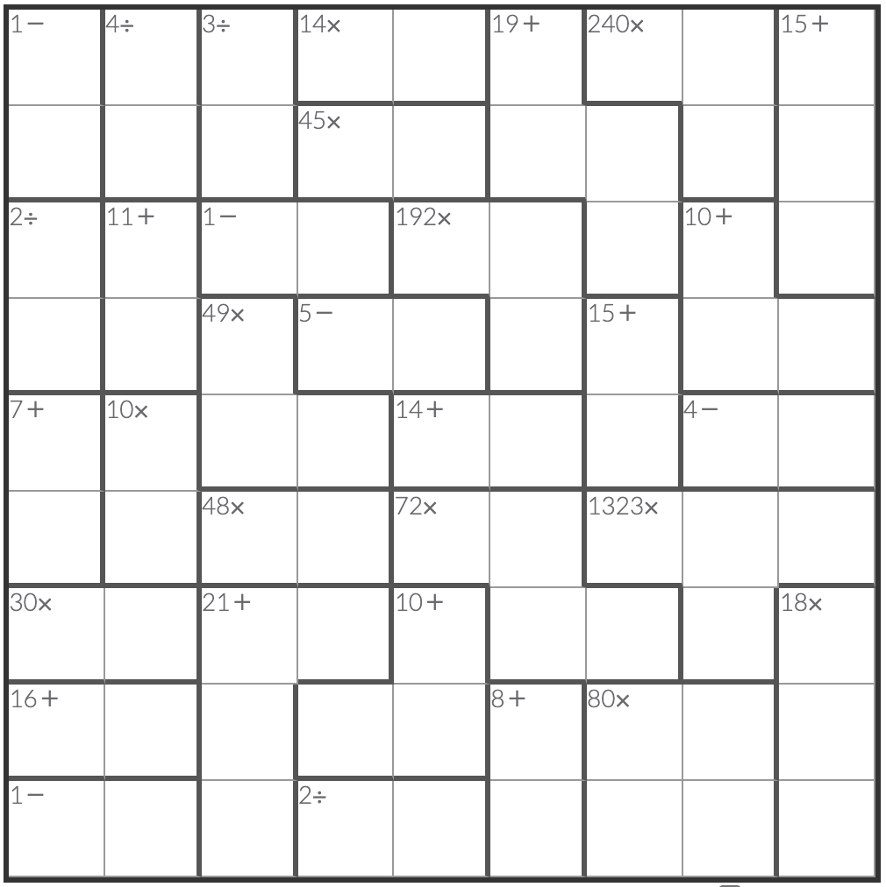

# 肯肯数独
<!-- START doctoc generated TOC please keep comment here to allow auto update -->
<!-- DON'T EDIT THIS SECTION, INSTEAD RE-RUN doctoc TO UPDATE -->
## 目录

- [规则](#%E8%A7%84%E5%88%99)
  - [标签](#%E6%A0%87%E7%AD%BE)
- [题型名](#%E9%A2%98%E5%9E%8B%E5%90%8D)
- [题库](#%E9%A2%98%E5%BA%93)
  - [在线题库](#%E5%9C%A8%E7%BA%BF%E9%A2%98%E5%BA%93)
  - [App](#app)
  - [微信小程序](#%E5%BE%AE%E4%BF%A1%E5%B0%8F%E7%A8%8B%E5%BA%8F)
- [扩展题型](#%E6%89%A9%E5%B1%95%E9%A2%98%E5%9E%8B)

<!-- END doctoc generated TOC please keep comment here to allow auto update -->

## 规则

| 序号  | 限制区域 | 限制规则                                |    备注     |
|:---:|:----:|:------------------------------------|:---------:|
|  1  |  行   | [1~9填充]                             |           |
|  2  |  列   | [1~9填充]                             |           |
|  3  | 计算框  | 提示数 `R[+-*/]`：计算框内所有数字经过指定运算后，结果为 R | 计算框内数字可重复 |

### 标签

- #计算/加法
- #计算/减法
- #计算/乘法
- #计算/除法

## 题型名

- 肯肯数独
- 聪明方格
- 聪明格
- Kendoku
- Kenken
- Keen

## 题库

### 在线题库

- [聪明方格](https://cn.newdoku.com/)
- [三思](https://www.12634.com/kendoku/9x9)
  - [加法](https://www.12634.com/kendoku/9x9/add?level=tricky)
  - [加减法](https://www.12634.com/kendoku/9x9/add-subtract?level=tricky)
  - [乘法](https://www.12634.com/kendoku/9x9/multiply?level=tricky)
  - [乘除法](https://www.12634.com/kendoku/9x9/multiply-divide?level=tricky)
  - [加减乘除法](https://www.12634.com/kendoku/9x9/asmd?level=tricky)
  - [无标](https://www.12634.com/kendoku/9x9/none?level=tricky)
- [Simon Tatham's Portable Puzzle Collection](https://www.chiark.greenend.org.uk/~sgtatham/puzzles/js/keen.html)

### App

- 算独
- 数独脑洞大开

### 微信小程序

- E学数独
- 肯肯数谜数独

## 扩展题型

- [肯肯+锯齿数独](../../混合类/肯肯+锯齿数独.md)
- TomTom

[1~9填充]: ../../../../rules.md#1to9填充
