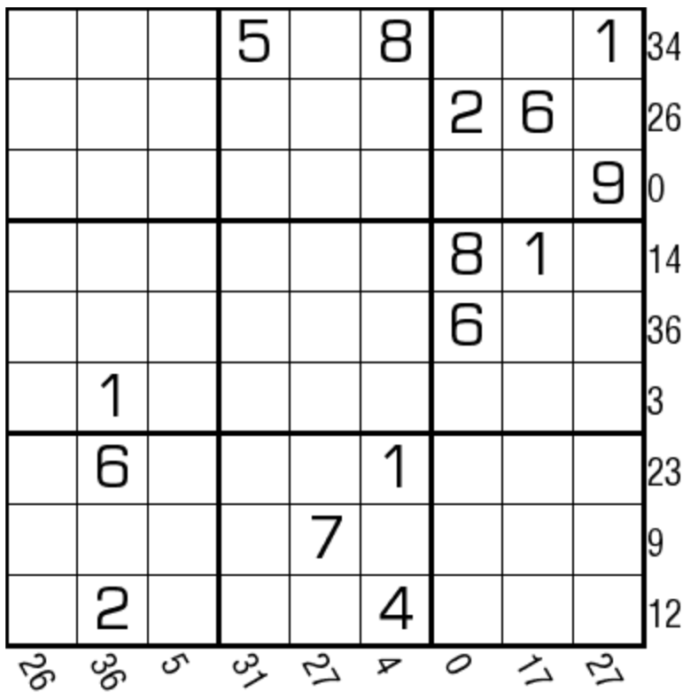

# 9后和数独

## 规则

| 序号  |  限制区域   | 限制规则                   |
|:---:|:-------:|:-----------------------|
|  1  |    行    | [1~9填充]                |
|  2  |    列    | [1~9填充]                |
|  3  |    宫    | [1~9填充]                |
|  4  | 提示数（盘右） | 提示数`S`：`9` 右边所有数的和 = S |
|  5  | 提示数（盘下） | 提示数`S`：`9` 下边所有数的和 = S |

### 标签

- [[加法]]
- [[连续位和]]

## 题库

### 在线题库

- [独·数之道](http://www.sudokufans.org.cn/lx/game.index.php?type=fdh3) 【需要登录】

[1~9填充]: ../../../../rules.md#1to9填充
