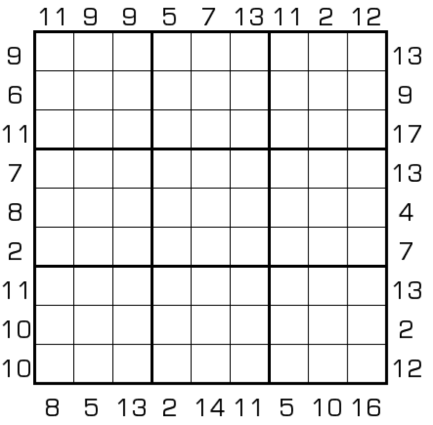

# 规则

| 序号  |  限制区域   | 限制规则                                             |
|:---:|:-------:|:-------------------------------------------------|
|  1  |    行    | [1~9填充]                                         |
|  2  |    列    | [1~9填充]                                         |
|  3  |    宫    | [1~9填充]                                         |
|  4  | 提示数（盘外） | 提示数`S`：当前位置向盘内看，第 1 格数字为 `X`，第 X 格数字为`Y`，`X+Y=S` |

# 题型名

- X位和数独

# 题库

## 在线题库

- [独·数之道](http://www.sudokufans.org.cn/lx/game.index.php?type=xsum2) 【需要登录】

## 微信小程序

- 变形数独

[1~9填充]: ../../../../rules.md#1to9填充
