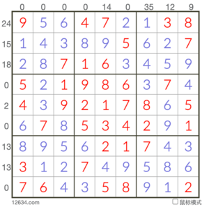

# 三明治数独

## 规则

| 序号  |  限制区域   | 限制规则                                  |
|:---:|:-------:|:--------------------------------------|
|  1  |    行    | [1~9填充]                               |
|  2  |    列    | [1~9填充]                               |
|  3  |    宫    | [1~9填充]                               |
|  4  | 提示数（盘外） | 提示数`S`：当前位置向盘内看，`1`和`9`两格之间的所有数字和为`S` |

### 标签

- [[加法]]
- [[连续位和]]
- [[三明治]]

## 题型名

- 三明治数独
- Sandwich Sudoku

## 题库

### 在线题库

- [三思数独]

## 离线题库

- [KrazyDad]

### 微信小程序

- 三思数独

## 扩展题型

- [锯齿+三明治数独](../../混合类/锯齿+三明治数独.md)
- [连续+三明治数独](../../混合类/连续+三明治数独.md)

[1~9填充]: ../../../../rules.md#1to9填充

[三思数独]: https://www.12634.com/sudoku/sandwich/level5

[KrazyDad]: https://krazydad.com/play/sandwich/
