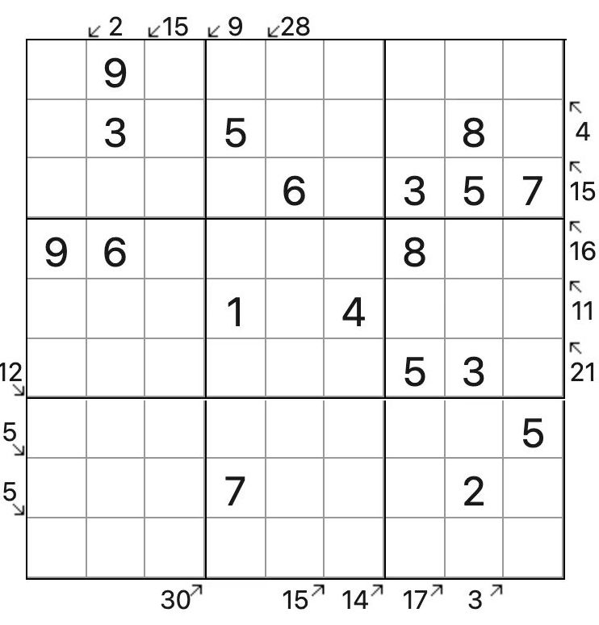

# 规则

| 序号  |  限制区域   | 限制规则                                       |
|:---:|:-------:|:-------------------------------------------|
|  1  |    行    | [1~9填充]                                    |
|  2  |    列    | [1~9填充]                                    |
|  3  |    宫    | [1~9填充]                                    |
|  4  | 提示数（盘外） | 提示数`S` + 斜方向：当前位置以斜方向向盘内看，线上所有格互不相同，且和为`S` |

## 标签

- [[加法]]
- [[连续位和]]

# 题型名

- 唯一小杀手数独

# 题库

## 微信小程序

- 三思数独

[1~9填充]: ../../../../rules.md#1to9填充