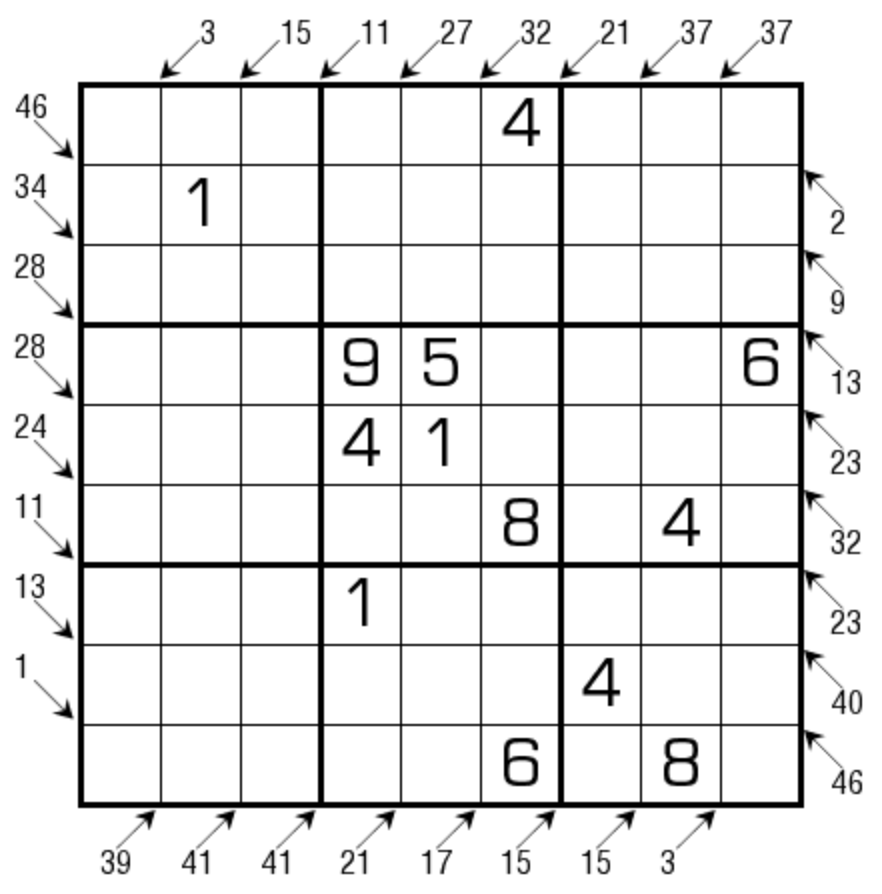

# 小杀手数独
<!-- START doctoc generated TOC please keep comment here to allow auto update -->
<!-- DON'T EDIT THIS SECTION, INSTEAD RE-RUN doctoc TO UPDATE -->

<!-- END doctoc generated TOC please keep comment here to allow auto update -->

## 规则

| 序号  |  限制区域   | 限制规则                                  |
|:---:|:-------:|:--------------------------------------|
|  1  |    行    | [1~9填充]                               |
|  2  |    列    | [1~9填充]                               |
|  3  |    宫    | [1~9填充]                               |
|  4  | 提示数（盘外） | 提示数`S` + 斜方向：当前位置以斜方向向盘内看，线上所有格的和为`S` |

### 标签

- #计算/加法/连续位和

## 题型名

- 小杀手数独
- Little Killer Sudoku

## 题库

### 在线题库

- [独·数之道](http://www.sudokufans.org.cn/lx/game.index.php?type=skiller) 【需要登录】
- [今日数独]【选题不便】

### 微信小程序

- 三思数独

## 扩展题型

- [唯一小杀手数独](./唯一小杀手数独.md)
- [小杀手+对角线数独](../../混合类/小杀手+对角线数独.md)
- [小杀手+无缘数独](../../混合类/小杀手+无缘数独.md)
- [小杀手+无马数独](../../混合类/小杀手+无马数独.md)
- [小杀手+无马+无缘数独](../../混合类/小杀手+无马+无缘数独.md)
- [小杀手+锯齿数独](../../混合类/小杀手+锯齿数独.md)

[1~9填充]: ../../../../rules/rules.md#1to9填充

[今日数独]: https://cn.sudoku.today/g-little-killer-sudoku/
