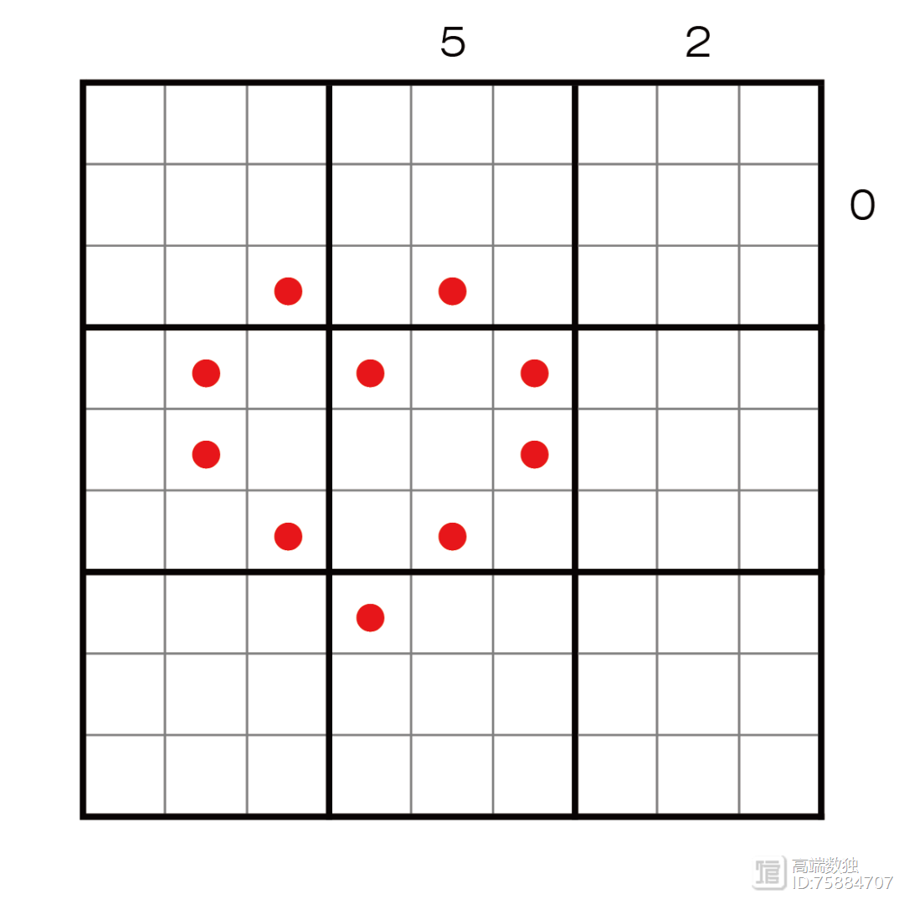

# 摆骨独
<!-- START doctoc generated TOC please keep comment here to allow auto update -->
<!-- DON'T EDIT THIS SECTION, INSTEAD RE-RUN doctoc TO UPDATE -->
## 目录

- [规则](#%E8%A7%84%E5%88%99)
  - [标签](#%E6%A0%87%E7%AD%BE)
- [题型名](#%E9%A2%98%E5%9E%8B%E5%90%8D)
- [题库](#%E9%A2%98%E5%BA%93)
  - [微信小程序](#%E5%BE%AE%E4%BF%A1%E5%B0%8F%E7%A8%8B%E5%BA%8F)

<!-- END doctoc generated TOC please keep comment here to allow auto update -->

## 规则

| 序号  |  限制区域   | 限制规则                 |
|:---:|:-------:|:---------------------|
|  1  |    宫    | 填入 1 个[骨牌]           |
|  2  |   全盘    | [1~9骨牌填充]            |
|  3  | 提示数（盘外） | 提示数`C`：当前行/列有 C 个骨牌点 |

### 标签

- #计算/加法

## 题型名

- 摆骨独
- Half Domino
- 别孤独

## 题库

### 微信小程序

- ~~变形数独~~

[骨牌]: ../../../../rules.md#骨牌

[1~9骨牌填充]: ../../../../rules.md#1to9骨牌填充
