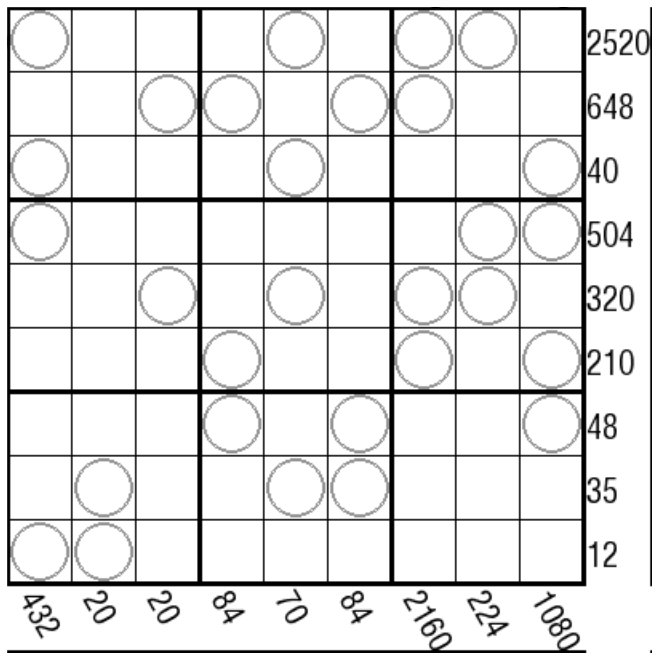

# 星积数独
<!-- START doctoc generated TOC please keep comment here to allow auto update -->
<!-- DON'T EDIT THIS SECTION, INSTEAD RE-RUN doctoc TO UPDATE -->

<!-- END doctoc generated TOC please keep comment here to allow auto update -->

## 规则

| 序号  |  限制区域   | 限制规则                      |
|:---:|:-------:|:--------------------------|
|  1  |    行    | [1~9填充]                   |
|  2  |    列    | [1~9填充]                   |
|  3  |    宫    | [1~9填充]                   |
|  4  | 提示数（盘右） | 提示数`P`：当前行中，标记格的数字之积为 `P` |
|  5  | 提示数（盘下） | 提示数`P`：当前列中，标记格的数字之积为 `P` |

### 标签

- #计算/乘法

## 题库

### 在线题库

- [独·数之道](http://www.sudokufans.org.cn/lx/game.index.php?type=xj) 【需要登录】

[1~9填充]: ../../../../rules/rules.md#1to9填充
