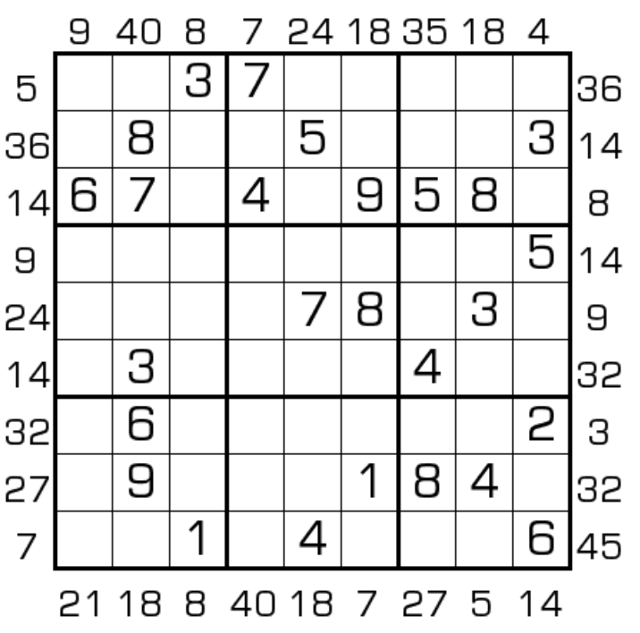

# 规则

| 序号  |  限制区域   | 限制规则                                 |
|:---:|:-------:|:-------------------------------------|
|  1  |    行    | [1~9填充]                              |
|  2  |    列    | [1~9填充]                              |
|  3  |    宫    | [1~9填充]                              |
|  4  | 提示数（盘外） | 提示数`P`：当前位置向盘内看，前 3 格中，最大数与最小数的积为`P` |

## 标签

- [[乘法]]

# 题型名

- 最大最小积数独

# 题库

## 在线题库

- [独·数之道](http://www.sudokufans.org.cn/lx/game.index.php?type=mm2) 【需要登录】

[1~9填充]: ../../../../rules.md#1to9填充