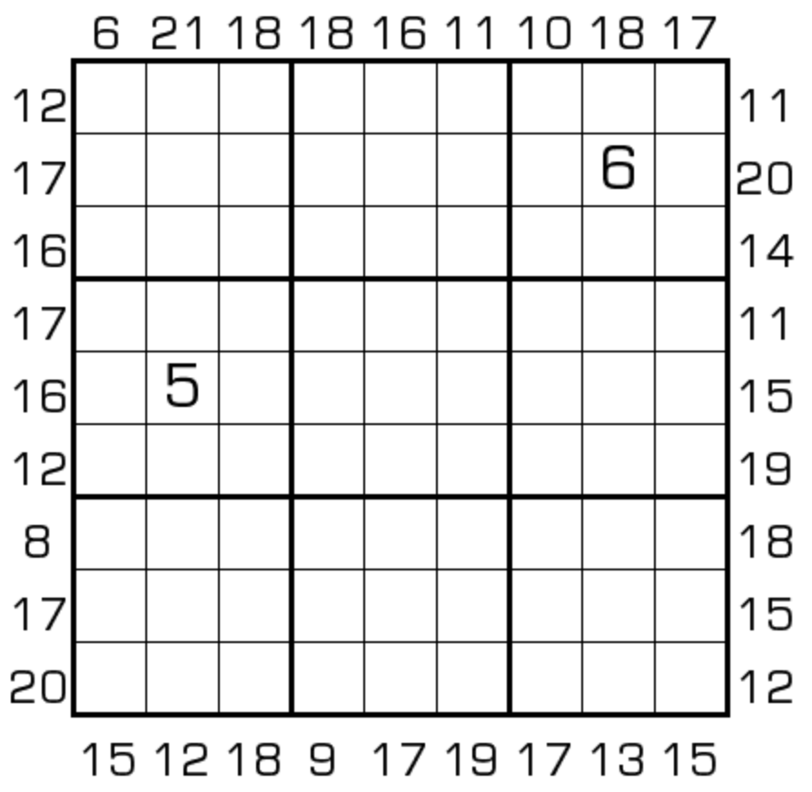

# 边框和数独
<!-- START doctoc generated TOC please keep comment here to allow auto update -->
<!-- DON'T EDIT THIS SECTION, INSTEAD RE-RUN doctoc TO UPDATE -->
## 目录

- [规则](#%E8%A7%84%E5%88%99)
  - [标签](#%E6%A0%87%E7%AD%BE)
- [题库](#%E9%A2%98%E5%BA%93)
  - [在线题库](#%E5%9C%A8%E7%BA%BF%E9%A2%98%E5%BA%93)
  - [微信小程序](#%E5%BE%AE%E4%BF%A1%E5%B0%8F%E7%A8%8B%E5%BA%8F)
- [扩展题型](#%E6%89%A9%E5%B1%95%E9%A2%98%E5%9E%8B)

<!-- END doctoc generated TOC please keep comment here to allow auto update -->

## 规则

| 序号  |  限制区域   | 限制规则                       |
|:---:|:-------:|:---------------------------|
|  1  |    行    | [1~9填充]                    |
|  2  |    列    | [1~9填充]                    |
|  3  |    宫    | [1~9填充]                    |
|  4  | 提示数（盘外） | 提示数`S`：当前位置向盘内看，前 3 格和为`S` |

### 标签

- #计算/加法/连续位和/前X位和

## 题库

### 在线题库

- [独·数之道](http://www.sudokufans.org.cn/lx/game.index.php?type=bk) 【需要登录】
- [今日数独]【选题不便】

### 微信小程序

- 三思数独

## 扩展题型

- [0-9 边框和](../../混合类/0-9边框和.md)
- [半标连续+边框和数独](../../混合类/半标连续+边框和数独.md)
- [数比+边框和数独](../../混合类/数比+边框和数独.md)

[1~9填充]: ../../../../rules/rules.md#1to9填充

[今日数独]: https://cn.sudoku.today/g-sum-frame-sudoku/
