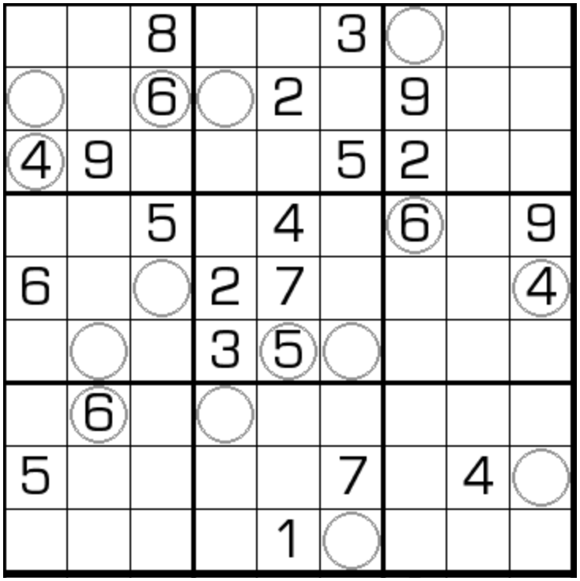

# 扫雷数独
<!-- START doctoc generated TOC please keep comment here to allow auto update -->
<!-- DON'T EDIT THIS SECTION, INSTEAD RE-RUN doctoc TO UPDATE -->

<!-- END doctoc generated TOC please keep comment here to allow auto update -->

## 规则

| 序号  |  限制区域  | 限制规则                                             | 备注  |
|:---:|:------:|:-------------------------------------------------|:---:|
|  1  |   行    | [1~9填充]                                          |     |
|  2  |   列    | [1~9填充]                                          |     |
|  3  |   宫    | [1~9填充]                                          |     |
|  4  | 提示数（格） | 提示数 `C`: 圆圈标记的提示格，其[邻格]中共存在 C 个奇数 ![提示示例图]   | 全标  |

### 标签

- #邻格限制

## 题型名

- 扫雷数独

## 题库

### 在线题库

- [独·数之道](http://www.sudokufans.org.cn/lx/game.index.php?type=mine) 【需要登录】

[1~9填充]: ../../../../../rules/rules.md#1to9填充

[邻格]: ../../../../../rules/rules.md#邻格

[提示示例图]: http://www.sudokufans.org.cn/img/mine_memo.png
