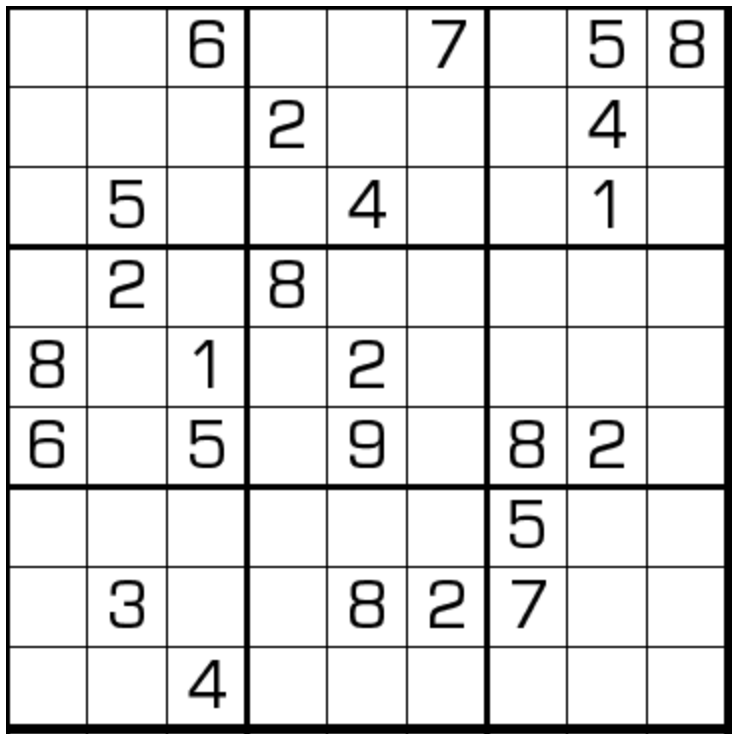

# 无缘数独
<!-- START doctoc generated TOC please keep comment here to allow auto update -->
<!-- DON'T EDIT THIS SECTION, INSTEAD RE-RUN doctoc TO UPDATE -->
## 目录

- [规则](#%E8%A7%84%E5%88%99)
  - [标签](#%E6%A0%87%E7%AD%BE)
- [题型名](#%E9%A2%98%E5%9E%8B%E5%90%8D)
- [题库](#%E9%A2%98%E5%BA%93)
  - [在线题库](#%E5%9C%A8%E7%BA%BF%E9%A2%98%E5%BA%93)
  - [微信小程序](#%E5%BE%AE%E4%BF%A1%E5%B0%8F%E7%A8%8B%E5%BA%8F)
- [技巧](#%E6%8A%80%E5%B7%A7)
- [扩展题型](#%E6%89%A9%E5%B1%95%E9%A2%98%E5%9E%8B)

<!-- END doctoc generated TOC please keep comment here to allow auto update -->

## 规则

| 序号  | 限制区域  | 限制规则              | 备注  |
|:---:|:-----:|:------------------|:---:|
|  1  |   行   | [1~9填充]           |     |
|  2  |   列   | [1~9填充]           |     |
|  3  |   宫   | [1~9填充]           |     |
|  4  |  全盘   | 对于任意格，其[邻格] ≠ 当前格 | 无标  |

### 标签

- #邻格限制
- #士步限制

## 题型名

- 无缘数独
- Untouchable Sudoku

## 题库

### 在线题库

- [三思数独]
- [独·数之道](http://www.sudokufans.org.cn/lx/game.index.php?type=wy) 【需要登录】
- [今日数独]

### 微信小程序

- 三思数独
- 君欢数独

## 技巧

- 区块
  - 间隔区块
  - 共边邻格区块
  - 三连格区块
  - 宫线区块

## 扩展题型

- [三无数独](../三无数独.md)
- [锯齿+无缘数独](../../../混合类/锯齿+无缘数独.md)
- [三明治+无缘数独](../../../混合类/三明治+无缘数独.md)
- [三明治+无马+无缘数独](../../../混合类/三明治+无马+无缘数独.md)
- [无马+无缘数独](../../../混合类/无马+无缘数独.md)
- [小杀手+无缘数独](../../../混合类/小杀手+无缘数独.md)
- [小杀手+无马+无缘数独](../../../混合类/小杀手+无马+无缘数独.md)
- [杀手+无缘数独](../../../混合类/杀手+无缘数独.md)
- [杀手+无马+无缘数独](../../../混合类/杀手+无马+无缘数独.md)

> 引用：
>
> - Bilibili：[19：无缘数独](https://www.bilibili.com/read/cv10214761)

[1~9填充]: ../../../../../rules/rules.md#1to9填充

[邻格]: ../../../../../rules/rules.md#邻格

[今日数独]: https://cn.sudoku.today/g-no-touch-sudoku/

[三思数独]: https://www.12634.com/sudoku/anti_king
