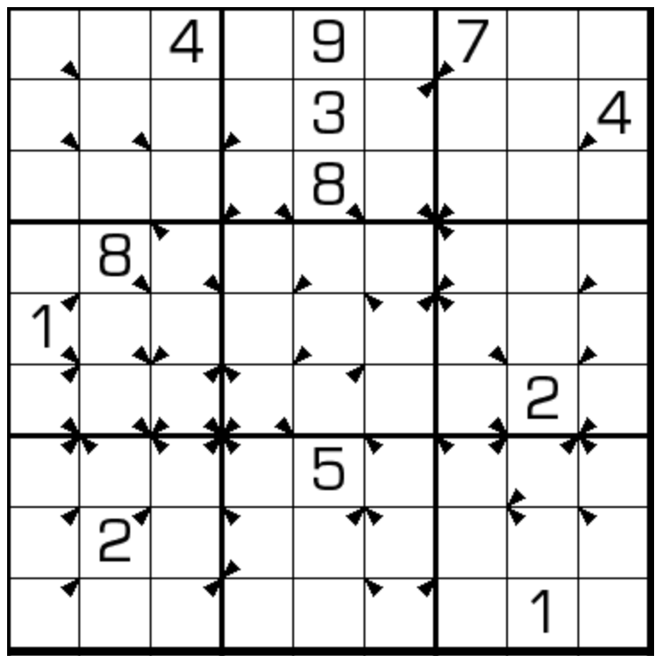

# 规则

| 序号  | 限制区域 | 限制规则                                     | 备注  |
|:---:|:----:|:-----------------------------------------|:---:|
|  1  |  行   | [1~9填充]                                  |     |
|  2  |  列   | [1~9填充]                                  |     |
|  3  |  宫   | [1~9填充]                                  |     |
|  4  | 标记符号 | 标记符号（三角）表示：当前格数字为 `A` ；且沿标记顶点方向，一定还存在`A` | 全标  |

## 标签

- [[斜向限制]]

# 题型名

- 侦查数独

# 题库

## 在线题库

- [独·数之道](http://www.sudokufans.org.cn/lx/game.index.php?type=detection) 【需要登录】

[1~9填充]: ../../../../../rules.md#1to9填充