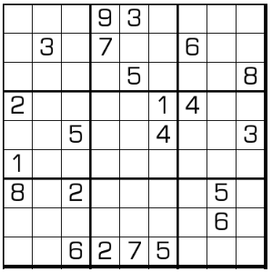

# 规则

| 序号  | 限制区域 | 限制规则              | 
|:---:|:----:|:------------------|
|  1  |  行   | [1~9填充]           |     
|  2  |  列   | [1~9填充]           |     
|  3  |  宫   | [1~9填充]           |     
|  4  |  全盘  | 任何 2*2 区域，都有奇数和偶数 |

## 标签

- [[奇偶]]

# 题型名

- 不纯粹奇偶

# 题库

## 在线题库

- [独·数之道](http://www.sudokufans.org.cn/lx/game.index.php?type=noe2) 【需要登录】

[1~9填充]: ../../../../../rules.md#1to9填充