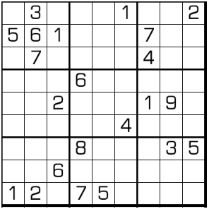

# 规则

| 序号  | 限制区域 | 限制规则                           | 
|:---:|:----:|:-------------------------------|
|  1  |  行   | [1~9填充]                        |     
|  2  |  列   | [1~9填充]                        |     
|  3  |  宫   | [1~9填充]                        |     
|  4  |  全盘  | 任意两行两列的 4 个交点格（呈矩形），至少包含 3 种数字 |

# 题型名

- 矩形数独

# 题库

## 在线题库

- [独·数之道](http://www.sudokufans.org.cn/lx/game.index.php?type=ur) 【需要登录】

[1~9填充]: ../../../../../rules.md#1to9填充