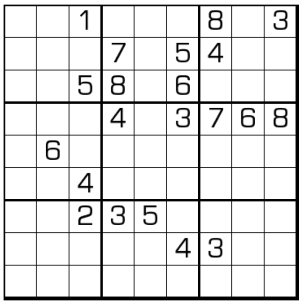

# 无象数独

## 规则

| 序号  | 限制区域  | 限制规则               | 备注  |
|:---:|:-----:|:-------------------|:---:|
|  1  |   行   | [1~9填充]            |     |
|  2  |   列   | [1~9填充]            |     |
|  3  |   宫   | [1~9填充]            |     |
|  4  |  全盘   | 对于任意格，其[象步]格 ≠ 当前格 | 无标  |

### 标签

- [[象步限制]]

## 题库

### 在线题库

- [独·数之道](http://www.sudokufans.org.cn/lx/game.index.php?type=wm2) 【需要登录】

## 扩展题型

- [三无数独](../三无数独.md)

[1~9填充]: ../../../../../rules.md#1to9填充

[象步]: ../../../../../rules.md#象步
