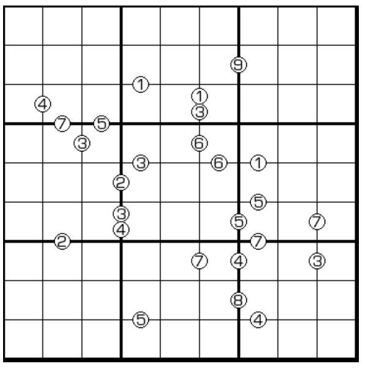

# 养马数独

## 规则

| 序号  |  限制区域  | 限制规则                                       | 备注  |
|:---:|:------:|:-------------------------------------------|:---:|
|  1  |   行    | [1~9填充]                                    |     |
|  2  |   列    | [1~9填充]                                    |     |
|  3  |   宫    | [1~9填充]                                    |     |
|  4  | 提示数（边） | 提示数`X`：若两格满足[马步约束]，则在其[马步中心]所在边上标记它们的数字`X` | 全标  |

### 标签

- [[马步限制]]

## 题库

### 在线题库

- [独·数之道](http://www.sudokufans.org.cn/lx/game.index.php?type=ym) 【需要登录】

## 扩展题型

- [跨栏马数独](../../../混合类/跨栏马数独.md)

[1~9填充]: ../../../../../rules.md#1to9填充

[马步约束]: ../../../../../rules.md#马步约束

[马步中心]: ../../../../../rules.md#马步中心
