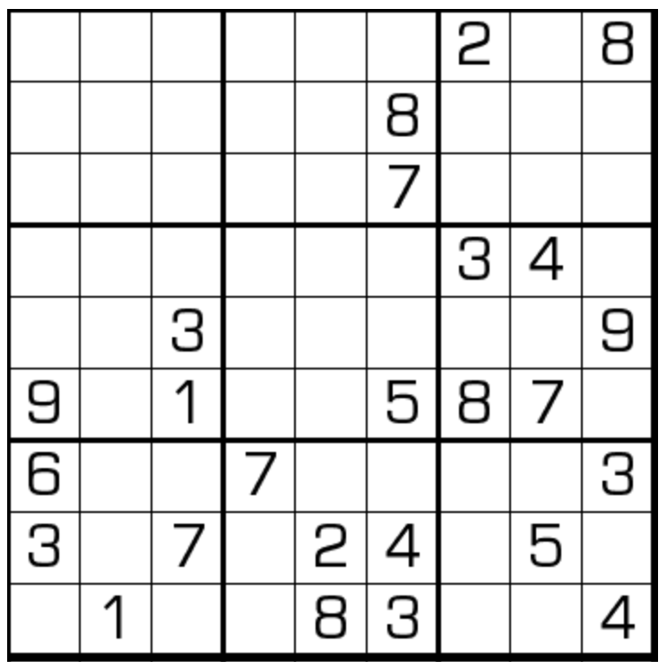

# 无马数独
<!-- START doctoc generated TOC please keep comment here to allow auto update -->
<!-- DON'T EDIT THIS SECTION, INSTEAD RE-RUN doctoc TO UPDATE -->
## 目录

- [规则](#%E8%A7%84%E5%88%99)
  - [标签](#%E6%A0%87%E7%AD%BE)
- [题型名](#%E9%A2%98%E5%9E%8B%E5%90%8D)
- [题库](#%E9%A2%98%E5%BA%93)
  - [在线题库](#%E5%9C%A8%E7%BA%BF%E9%A2%98%E5%BA%93)
  - [微信小程序](#%E5%BE%AE%E4%BF%A1%E5%B0%8F%E7%A8%8B%E5%BA%8F)
- [技巧](#%E6%8A%80%E5%B7%A7)
- [扩展题型](#%E6%89%A9%E5%B1%95%E9%A2%98%E5%9E%8B)

<!-- END doctoc generated TOC please keep comment here to allow auto update -->

## 规则

| 序号  | 限制区域 | 限制规则               | 备注  |
|:---:|:----:|:-------------------|:---:|
|  1  |  行   | [1~9填充]            |     |
|  2  |  列   | [1~9填充]            |     |
|  3  |  宫   | [1~9填充]            |     |
|  4  |  全盘  | 对于任意格，其[马步]格 ≠ 当前格 | 无标  |

> 规则与 [养马数独] 相同（即无标的 [养马数独]）

### 标签

- #马步限制

## 题型名

- 无马数独
- Anti Knight Sudoku

## 题库

### 在线题库

- [三思数独]
- [独·数之道](http://www.sudokufans.org.cn/lx/game.index.php?type=wm) 【需要登录】
- [今日数独]【选题不便】

### 微信小程序

- 三思数独

## 技巧

- [无马区块](https://www.bilibili.com/read/cv10105179)
  - 宫内边邻区块
    - 
  - 宫内边中区块
    - 
  - 宫内边角区块
    - 
  - 两宫菱形区块
    - 
  - 两宫等腰梯形区块
    - 
  - 三宫等腰三角区块
    - 
  - 六宫8字形区块
    - 
  - 三格拐角区块
    - 
  - 三格V形对称区块
    - 
  - 三格共线区块
    - 

## 扩展题型

- [三无数独](../三无数独.md)

> 引用：
>
> - Bilibili：[7：无马数独](https://www.bilibili.com/read/cv10105179)

[1~9填充]: ../../../../../rules.md#1to9填充

[马步]: ../../../../../rules.md#马步

[养马数独]: 养马数独.md

[今日数独]: https://cn.sudoku.today/g-anti-knight-sudoku/

[三思数独]: https://www.12634.com/sudoku/anti_knight/level5
