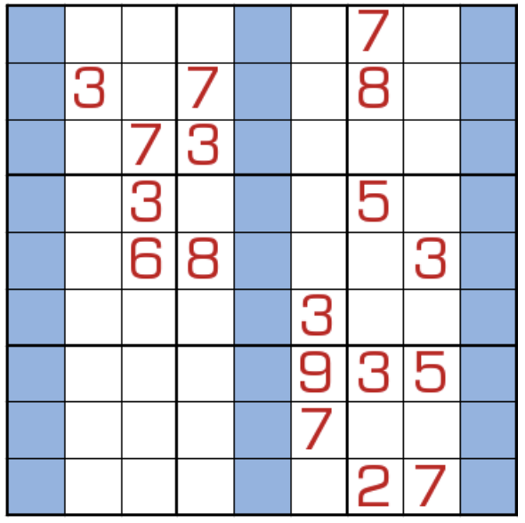

# 159数独
<!-- START doctoc generated TOC please keep comment here to allow auto update -->
<!-- DON'T EDIT THIS SECTION, INSTEAD RE-RUN doctoc TO UPDATE -->

<!-- END doctoc generated TOC please keep comment here to allow auto update -->

## 规则

| 序号  | 限制区域 | 限制规则              |
|:---:|:----:|:------------------|
|  1  |  行   | [1~9填充]           |
|  2  |  列   | [1~9填充]           |
|  3  |  宫   | [1~9填充]           |
|  4  |  行   | 第一格为`X`，第 X 格是`1` |
|  5  |  行   | 第五格为`Y`，第 Y 格是`5` |
|  6  |  行   | 第五格为`Z`，第 Z 格是`9` |

## 题型名

- 159 数独
- 1-5-9数独

## 题库

### 在线题库

- [独·数之道](http://www.sudokufans.org.cn/lx/game.index.php?type=159) 【需要登录】

## 扩展题型

- 一类一题
  - [LMD](https://logic-masters.de/Raetselportal/Suche/erweitert.php?tag_id=9333)

[1~9填充]: ../../../../rules/rules.md#1to9填充
