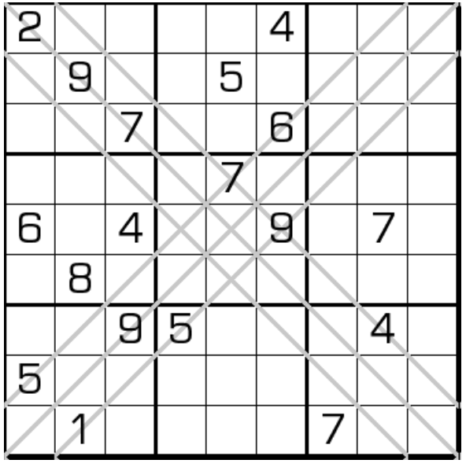

# xXx数独
<!-- START doctoc generated TOC please keep comment here to allow auto update -->
<!-- DON'T EDIT THIS SECTION, INSTEAD RE-RUN doctoc TO UPDATE -->

<!-- END doctoc generated TOC please keep comment here to allow auto update -->

## 规则

| 序号  | 限制区域  | 限制规则     | 备注       |
|:---:|:-----:|:---------|----------|
|  1  |   行   | [1~9填充]  | 9 行      |
|  2  | 标记上斜线 | [1~9不重复] | 3 条[上斜线] |
|  3  | 标记下斜线 | [1~9不重复] | 3 条[下斜线] |
|  4  |   宫   | [1~9填充]  | 9 个宫     |

### 标签

- #斜线

## 题库

### 在线题库

- [独·数之道](http://www.sudokufans.org.cn/lx/game.index.php?type=x6) 【需要登录】

[1~9填充]: ../../../../rules/rules.md#1to9填充

[1~9不重复]: ../../../../rules/rules.md#1to9不重复

[上斜线]: ../../../../rules/rules.md#上斜线

[下斜线]: ../../../../rules/rules.md#下斜线
