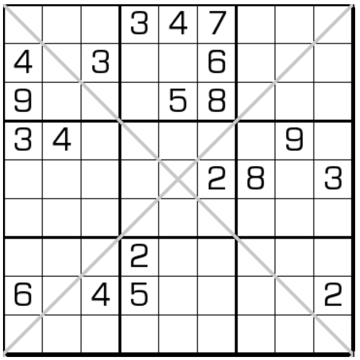

# 单反数独
<!-- START doctoc generated TOC please keep comment here to allow auto update -->
<!-- DON'T EDIT THIS SECTION, INSTEAD RE-RUN doctoc TO UPDATE -->
## 目录

- [规则](#%E8%A7%84%E5%88%99)
  - [标签](#%E6%A0%87%E7%AD%BE)
- [题型名](#%E9%A2%98%E5%9E%8B%E5%90%8D)
- [题库](#%E9%A2%98%E5%BA%93)
  - [在线题库](#%E5%9C%A8%E7%BA%BF%E9%A2%98%E5%BA%93)

<!-- END doctoc generated TOC please keep comment here to allow auto update -->

## 规则

<!-- markdownlint-disable MD013 -->
| 序号  | 限制区域 | 限制规则                      | 备注                           |
|:---:|:----:|:--------------------------|------------------------------|
|  1  |  行   | [1~9填充]                   |                              |
|  2  |  列   | [1~9填充]                   |                              |
|  3  |  宫   | [1~9填充]                   |                              |
|  4  | 对角线  | 一条满足[对角线约束]，另一条满足[反对角线约束] | 两条对角线：一条上有 9 种数字，另一条上有 3 种数字 |
<!-- markdownlint-enable MD013 -->

### 标签

- [[对角线]]
- [[反对角线]]

## 题型名

- 单反数独
- Diagonal and Anti Diagonal Sudoku

## 题库

### 在线题库

- [独·数之道](http://www.sudokufans.org.cn/lx/game.index.php?type=fx2) 【需要登录】

[1~9填充]: ../../../../rules.md#1to9填充

[对角线约束]: ../../../../rules.md#对角线约束

[反对角线约束]: ../../../../rules.md#反对角线约束
