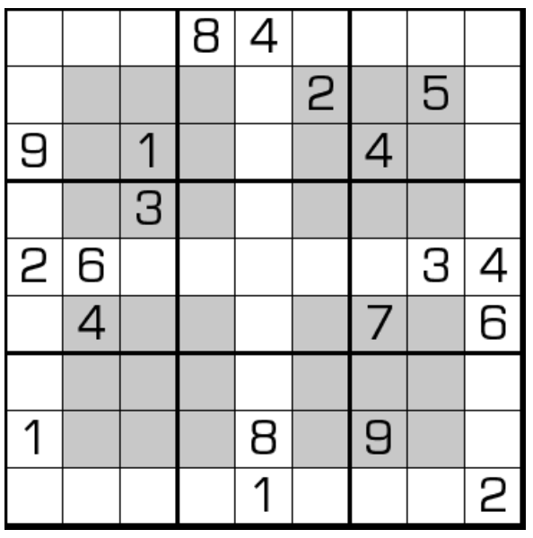

# 反窗口数独

## 规则

| 序号  | 限制区域 | 限制规则          | 备注    |
|:---:|:----:|:--------------|-------|
|  1  |  行   | [1~9填充]       |       |
|  2  |  列   | [1~9填充]       |       |
|  3  |  宫   | [1~9填充]       |       |
|  4  |  窗口  | 一个窗口中只有 4 种数字 | 4 个窗口 |

### 标签

- [[窗口]]

## 题库

### 在线题库

- [独·数之道](http://www.sudokufans.org.cn/lx/game.index.php?type=win2) 【需要登录】

[1~9填充]: ../../../../rules.md#1to9填充
