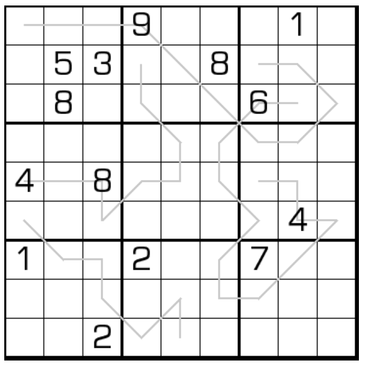

# 回文数独
<!-- START doctoc generated TOC please keep comment here to allow auto update -->
<!-- DON'T EDIT THIS SECTION, INSTEAD RE-RUN doctoc TO UPDATE -->
## 目录

- [规则](#%E8%A7%84%E5%88%99)
  - [标签](#%E6%A0%87%E7%AD%BE)
- [题型名](#%E9%A2%98%E5%9E%8B%E5%90%8D)
- [题库](#%E9%A2%98%E5%BA%93)
  - [在线题库](#%E5%9C%A8%E7%BA%BF%E9%A2%98%E5%BA%93)
  - [微信小程序](#%E5%BE%AE%E4%BF%A1%E5%B0%8F%E7%A8%8B%E5%BA%8F)

<!-- END doctoc generated TOC please keep comment here to allow auto update -->

## 规则

| 序号  | 限制区域 | 限制规则          | 备注           |
|:---:|:----:|:--------------|--------------|
|  1  |  行   | [1~9填充]       |              |
|  2  |  列   | [1~9填充]       |              |
|  3  |  宫   | [1~9填充]       |              |
|  4  | 标记线  | 标记线上的数字满足回文约束 | 从两头开始阅读的序列相同 |

### 标签

- #回文

## 题型名

- 回文数独
- Palindrome Sudoku

## 题库

### 在线题库

- [独·数之道](http://www.sudokufans.org.cn/lx/game.index.php?type=hw) 【需要登录】
- [今日数独]【选题不便】

[今日数独]: https://cn.sudoku.today/g-palindrome-sudoku/

### 微信小程序

- ~~变形数独~~

[1~9填充]: ../../../../rules/rules.md#1to9填充
