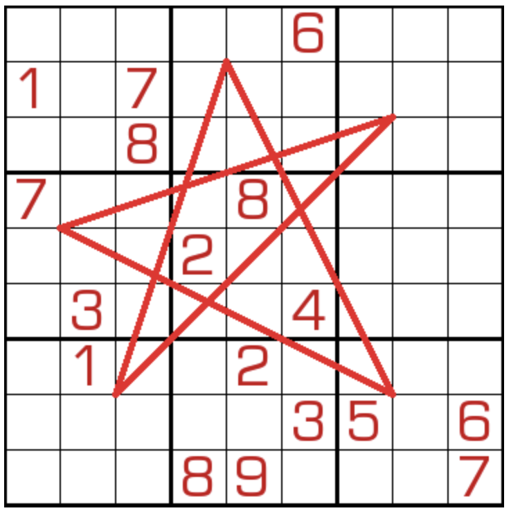

# 小五星数独

## 规则

| 序号  | 限制区域 | 限制规则     | 备注   |
|:---:|:----:|:---------|:-----|
|  1  |  行   | [1~9填充]  |      |
|  2  |  列   | [1~9填充]  |      |
|  3  |  宫   | [1~9填充]  |      |
|  4  | 标记线  | [1~9不重复] | 5 条线 |

### 标记

- [[斜线]]
- [[五星]]

## 题库

### 在线题库

- [独·数之道](http://www.sudokufans.org.cn/lx/game.index.php?type=5x2) 【需要登录】

[1~9填充]: ../../../../rules.md#1to9填充

[1~9不重复]: ../../../../rules.md#1to9不重复
