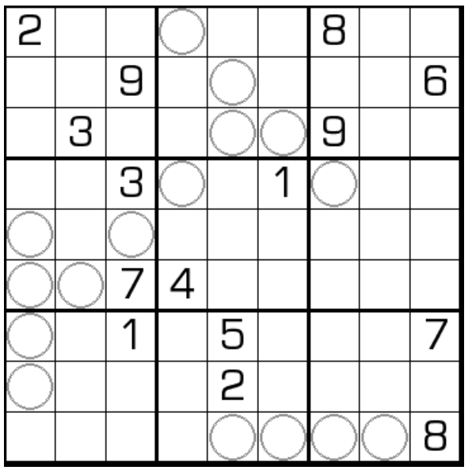

# 烤串数独
<!-- START doctoc generated TOC please keep comment here to allow auto update -->
<!-- DON'T EDIT THIS SECTION, INSTEAD RE-RUN doctoc TO UPDATE -->

<!-- END doctoc generated TOC please keep comment here to allow auto update -->

## 规则

| 序号  | 限制区域 | 限制规则                                                | 备注    |
|:---:|:----:|:----------------------------------------------------|:------|
|  1  |  行   | [1~9填充]                                             |       |
|  2  |  列   | [1~9填充]                                             |       |
|  3  |  宫   | [1~9填充]                                             |       |
|  4  | 标记区域 | 标记区域`烤串`：  - 一个烤串上有 4 种不同的数字  - 所有烤串平移旋转后完全相同 | 4 个烤串 |

### 标签

- #克隆

## 题库

### 在线题库

- [独·数之道](http://www.sudokufans.org.cn/lx/game.index.php?type=kc) 【需要登录】

[1~9填充]: ../../../../rules/rules.md#1to9填充
