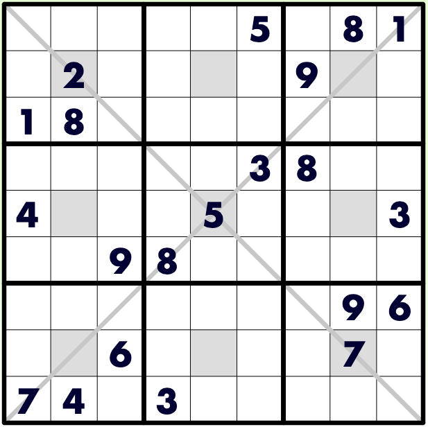

# Prisoner Sudoku

## 规则

| 序号  | 限制区域 | 限制规则    | 备注       |
|:---:|:----:|:--------|:---------|
|  1  |  行   | [1~9填充] |          |
|  2  |  列   | [1~9填充] |          |
|  3  |  宫   | [1~9填充] | 9 个宫     |
|  4  | 对角线  | [1~9填充] |          |
|  5  | 额外区域 | [1~9填充] | 9 个宫的中心格 |

### 标签

- [[额外宫]]
- [[对角线]]

## 题库

### 在线题库

- [KrazyDad](https://krazydad.com/play/prisoner/)

[1~9填充]: ../../../../../rules.md#1to9填充
