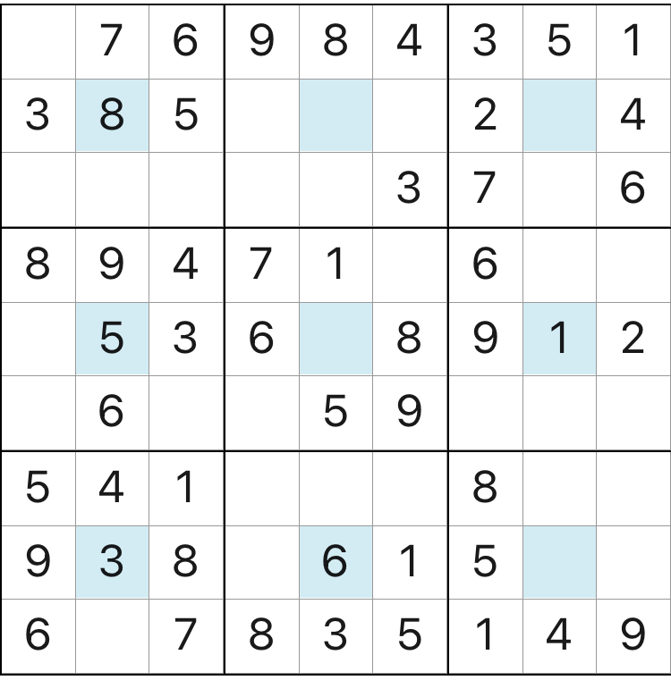

# 规则

| 序号  | 限制区域 | 限制规则    | 备注       |
|:---:|:----:|:--------|:---------|
|  1  |  行   | [1~9填充] |          |
|  2  |  列   | [1~9填充] |          |
|  3  |  宫   | [1~9填充] | 9 个宫     |
|  4  | 额外区域 | [1~9填充] | 9 个宫的中心格 |

# 题型名

- 中心数独

# 题库

## 微信小程序
- 三思数独

# 扩展题型

[同位数独](同位数独.md)

[1~9填充]: ../../../../../rules.md#1~9填充