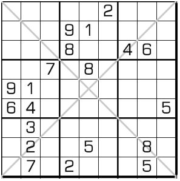

# 对角线数独
<!-- START doctoc generated TOC please keep comment here to allow auto update -->
<!-- DON'T EDIT THIS SECTION, INSTEAD RE-RUN doctoc TO UPDATE -->

<!-- END doctoc generated TOC please keep comment here to allow auto update -->

## 规则

| 序号  | 限制区域 | 限制规则    |
|:---:|:----:|:--------|
|  1  |  行   | [1~9填充] |
|  2  |  列   | [1~9填充] |
|  3  |  宫   | [1~9填充] |
|  4  | 对角线  | [1~9填充] |

### 标签

- #斜线/对角线
- #额外宫

## 题型名

- 对角线数独
- X 数独
- X Sudoku
- Sudoku X
- Diagonal Sudoku

## 题库

### 在线题库

- [独·数之道](http://www.sudokufans.org.cn/lx/game.index.php?type=x) 【需要登录】
- [有一个数独](https://shudu.one/x-sudoku.php)
- [KrazyDad](https://krazydad.com/play/xsudoku/)
- [Simon Tatham's Portable Puzzle Collection](https://www.chiark.greenend.org.uk/~sgtatham/puzzles/js/solo.html)

### App

- 数独脑洞大开

### 微信小程序

- E学数独
- 鳄鱼数独
- 口袋数独
- 破解数独
- 三思数独
- 数独大乱斗
- 数独谜题
- 数独天地

## 解题工具

- [Sudoku X Solver by Andrew Stuart](https://www.sudokuwiki.org/sudokux.htm)

## 特色题型

- 标记对角线数独
  - 三思数独

## 扩展题型

- [单反数独](../单反数独.md)
- [xXx数独](../xXx数独.md)
- [金字塔对角线数独](金字塔对角线数独.md)
- [Prisoner Sudoku](PrisonerSudoku.md)
- [Tower+对角数独](../../../混合类/Tower+对角数独.md)
- [Tower+花园+对角数独](../../../混合类/Tower+花园+对角数独.md)
- [摩天和+对角数独](../../../../8宫/混合类/摩天和+对角数独.md)
- [摩天和+花园+对角数独](../../../../8宫/混合类/摩天和+花园+对角数独.md)
- [小杀手+对角线数独](../../../混合类/小杀手+对角线数独.md)
- [数比+对角数独](../../../混合类/数比+对角数独.md)
- [无马+对角数独](../../../混合类/无马+对角数独.md)
- [杀手+对角数独](../../../混合类/杀手+对角数独.md)
- [锯齿+对角数独](../../../混合类/锯齿+对角数独.md)
- [窗口+对角数独](窗口+对角数独.md)
- [同位+对角数独](同位+对角数独.md)
- [数比+对角+杀手数独](../../../混合类/数比+对角+杀手数独.md)
- [杀手+锯齿+对角数独](../../../混合类/杀手+锯齿+对角数独.md)

[1~9填充]: ../../../../../rules/rules.md#1to9填充
