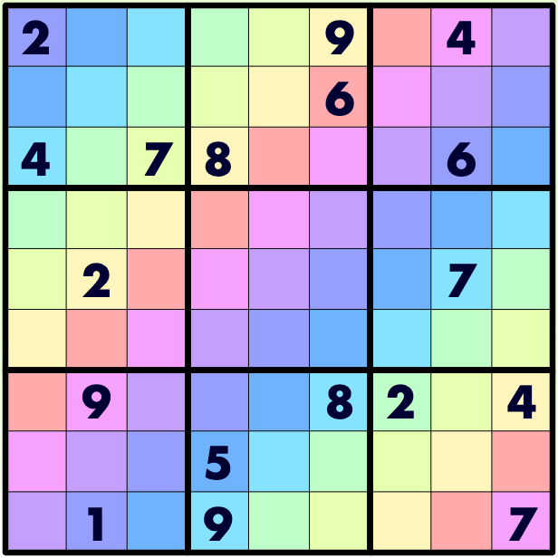

# 彩虹数独

## 规则

| 序号  | 限制区域 | 限制规则    | 备注                         |
|:---:|:----:|:--------|----------------------------|
|  1  |  行   | [1~9填充] |                            |
|  2  |  列   | [1~9填充] |                            |
|  3  |  宫   | [1~9填充] |                            |
|  4  | 彩虹线  | [1~9填充] | 9 条彩虹线，穿过边界连续的上斜线，一般使用同色标记 |

### 标签

- [[斜线]]
- [[额外宫]]

## 题型名

- 彩虹数独
- Rainbow Sudoku

## 题库

### 在线题库

- [KrazyDad](https://krazydad.com/play/rainbow/)

## 扩展题型

- [彩虹+锯齿数独](../../../混合类/彩虹+锯齿数独.md)

[1~9填充]: ../../../../../rules.md#1to9填充
