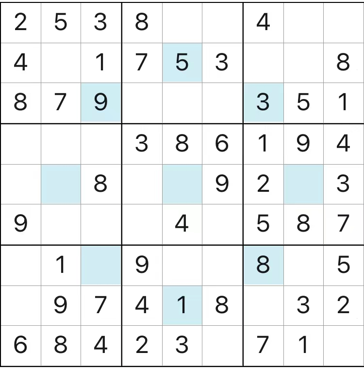

# 规则

| 序号  | 限制区域 | 限制规则    | 备注         |
|:---:|:----:|:--------|:-----------|
|  1  |  行   | [1~9填充] |            |
|  2  |  列   | [1~9填充] |            |
|  3  |  宫   | [1~9填充] | 9 个宫       |
|  4  | 额外区域 | [1~9填充] | 9 个标记格组成星形 |

# 题型名

- 星形数独

# 题库

## 微信小程序
- 三思数独

[1~9填充]: ../../../../../rules.md#1to9填充