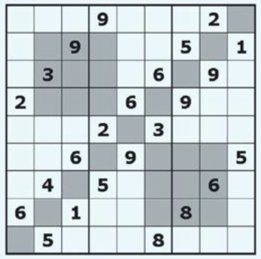

# 百分比数独

## 规则

| 序号  | 限制区域 | 限制规则    | 备注         |
|:---:|:----:|:--------|:-----------|
|  1  |  行   | [1~9填充] |            |
|  2  |  列   | [1~9填充] |            |
|  3  |  宫   | [1~9填充] | 9 个宫       |
|  4  | 上对角线 | [1~9填充] | 1 条 [上对角线] |
|  5  |  窗口  | [1~9填充] | 2 个窗口      |

### 标签

- [[额外宫]]
- [[对角线]]
- [[窗口]]

## 题型名

- 百分号数独

### 微信小程序

- 破解数独
- ~~变形数独~~

[1~9填充]: ../../../../../rules.md#1to9填充

[上对角线]: ../../../../../rules.md#上对角线
