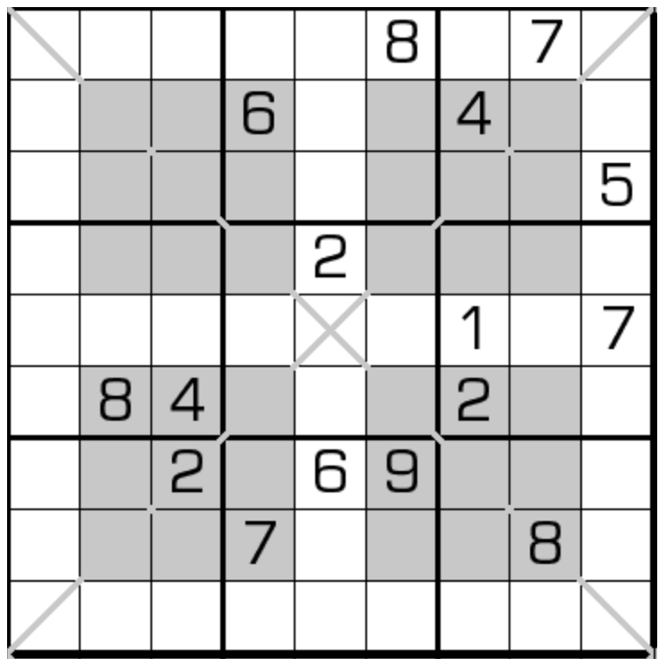

# 窗口+对角数独

## 规则

| 序号  | 限制区域 | 限制规则    | 备注     |
|:---:|:----:|:--------|:-------|
|  1  |  行   | [1~9填充] |        |
|  2  |  列   | [1~9填充] |        |
|  3  |  宫   | [1~9填充] |        |
|  4  |  窗口  | [1~9填充] | 4 个窗口  |
|  5  | 对角线  | [1~9填充] | &nbsp; |

### 标签

- [[窗口]]
- [[对角线]]

## 题型名

- 窗口+对角数独
- Cellblock Sudoku

## 题库

### 在线题库

- [独·数之道](http://www.sudokufans.org.cn/lx/game.index.php?type=winx) 【需要登录】
- [KrazyDad](https://krazydad.com/play/cellblock/)

[1~9填充]: ../../../../../rules.md#1to9填充
