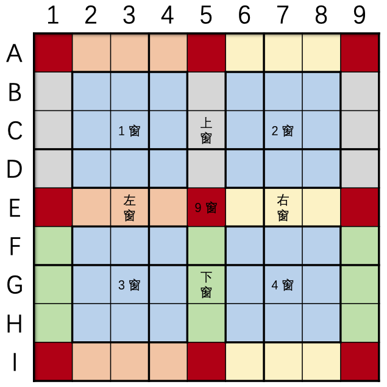

# 窗口数独

## 规则

| 序号  | 限制区域 | 限制规则    | 备注    |
|:---:|:----:|:--------|:------|
|  1  |  行   | [1~9填充] |       |
|  2  |  列   | [1~9填充] |       |
|  3  |  宫   | [1~9填充] | 9 个宫  |
|  4  |  窗口  | [1~9填充] | 4 个窗口 |

### 标签

- [[额外宫]]
- [[窗口]]

## 题型名

- 窗口数独
- 超数独
- Hyper Sudoku
- Windoku

## 题库

### 在线题库

- [独·数之道](http://www.sudokufans.org.cn/lx/game.index.php?type=win) 【需要登录】
- [今日数独]【选题不便】
- [有一个数独](https://shudu.one/hyper-sudoku.php)

### 微信小程序

- E学数独
- 三思数独
- 数独星空
- 破解数独

## 技巧

- [十八宫](https://www.bilibili.com/read/cv10045615)
  - 额外窗
    - 左 窗：`{A,E,I}{2-4}`
    - 右 窗：`{A,E,I}{6-8}`
    - 上 窗：`{B-D}{1,5,9}`
    - 下 窗：`{F-H}{1,5,9}`
    - 9 窗（18 宫）：`{A,E,I}{1,5,9}`
  - 

## 扩展题型

- [窗口+对角数独](窗口+对角数独.md)
- [连续+窗口数独](../../../混合类/连续+窗口数独.md)
- [锯齿+窗口数独](../../../混合类/锯齿+窗口数独.md)
- [窗口+连续+锯齿数独](../../../混合类/窗口+连续+锯齿数独.md)

[1~9填充]: ../../../../../rules.md#1to9填充

[今日数独]: https://cn.sudoku.today/g-windoku/
