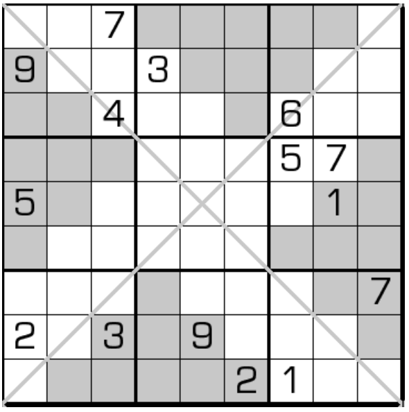

# 金字塔对角线数独

## 规则

| 序号  | 限制区域 | 限制规则    | 备注     |
|:---:|:----:|:--------|:-------|
|  1  |  行   | [1~9填充] |        |
|  2  |  列   | [1~9填充] |        |
|  3  |  宫   | [1~9填充] | 9 个宫   |
|  4  | 对角线  | [1~9填充] | 2 条对角线 |
|  5  | 金字塔  | [1~9填充] | 4 个金字塔 |

### 标签

- [[额外宫]]
- [[对角线]]
- [[金字塔]]

## 题库

### 在线题库

- [独·数之道](http://www.sudokufans.org.cn/lx/game.index.php?type=xxx) 【需要登录】

[1~9填充]: ../../../../../rules.md#1to9填充
