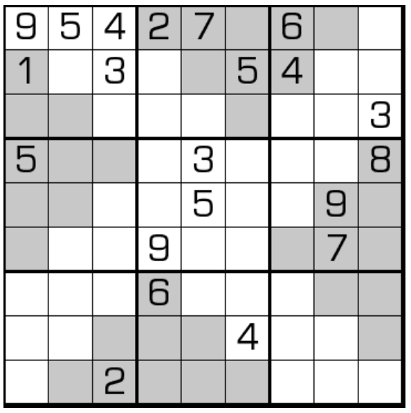

# 金字塔数独
<!-- START doctoc generated TOC please keep comment here to allow auto update -->
<!-- DON'T EDIT THIS SECTION, INSTEAD RE-RUN doctoc TO UPDATE -->
## 目录

- [规则](#%E8%A7%84%E5%88%99)
  - [标签](#%E6%A0%87%E7%AD%BE)
- [题型名](#%E9%A2%98%E5%9E%8B%E5%90%8D)
- [题库](#%E9%A2%98%E5%BA%93)
  - [在线题库](#%E5%9C%A8%E7%BA%BF%E9%A2%98%E5%BA%93)
- [技巧](#%E6%8A%80%E5%B7%A7)
- [扩展题型](#%E6%89%A9%E5%B1%95%E9%A2%98%E5%9E%8B)

<!-- END doctoc generated TOC please keep comment here to allow auto update -->

## 规则

| 序号  | 限制区域 | 限制规则    | 备注     |
|:---:|:----:|:--------|:-------|
|  1  |  行   | [1~9填充] |        |
|  2  |  列   | [1~9填充] |        |
|  3  |  宫   | [1~9填充] | 9 个宫   |
|  4  | 金字塔  | [1~9填充] | 4 个金字塔 |

### 标签

- [[额外宫]]
- [[金字塔]]

## 题型名

- 金字塔数独
- Pyramid Sudoku

## 题库

### 在线题库

- [独·数之道](http://www.sudokufans.org.cn/lx/game.index.php?type=xx) 【需要登录】

## 技巧

- [割补法](https://www.bilibili.com/read/cv10181020)
  - 宫割补
  - 行列割补
- [金字塔数对](https://www.bilibili.com/read/cv10181020)

## 扩展题型

- [金字塔对角线数独](金字塔对角线数独.md)

> 引用：
>
> - Bilibili：[14：金字塔数独](https://www.bilibili.com/read/cv10181020)

[1~9填充]: ../../../../../rules.md#1to9填充
