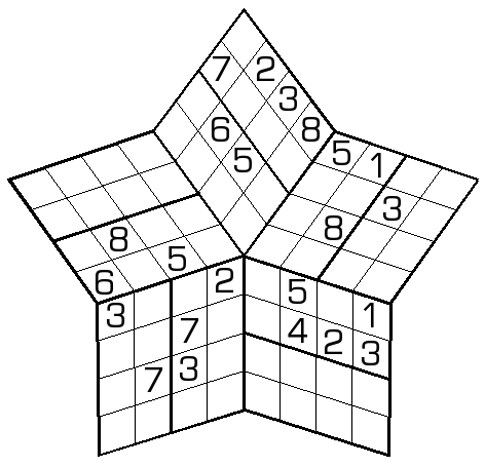

## 规则
| 序号 | 限制区域 | 限制规则 | 备注 |
| :---: | :---: | :--- | :---: |
| 1 | 宫 | [1~8填充] | 10 个宫 |
| 2 | [共边平行区域] | [1~8填充] | 20 个区域 |

## 题库
- [独·数之道](http://www.sudokufans.org.cn/lx/game.index.php?type=8w) 【需要登录】

[1~8填充]: ../../rules.md#1~8填充
[共边平行区域]: ../../rules.md#共边平行区域