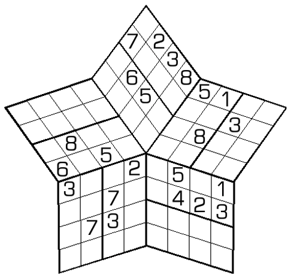

<!-- START doctoc generated TOC please keep comment here to allow auto update -->
<!-- DON'T EDIT THIS SECTION, INSTEAD RE-RUN doctoc TO UPDATE -->
## 目录

- [8 阶五星](#8-%E9%98%B6%E4%BA%94%E6%98%9F)
  - [目录](#%E7%9B%AE%E5%BD%95)
  - [规则](#%E8%A7%84%E5%88%99)
    - [标签](#%E6%A0%87%E7%AD%BE)
  - [题库](#%E9%A2%98%E5%BA%93)
    - [在线题库](#%E5%9C%A8%E7%BA%BF%E9%A2%98%E5%BA%93)

<!-- END doctoc generated TOC please keep comment here to allow auto update -->

# 8 阶五星

## 目录

- [规则](8阶五星.md#规则)
  - [标签](8阶五星.md#标签)
- [题库](8阶五星.md#题库)
  - [在线题库](8阶五星.md#在线题库)

## 规则

|  序号 |                 限制区域                | 限制规则                                  |     备注    |
| :-: | :---------------------------------: | ------------------------------------- | :-------: |
|  1  |                  宫                  | [1\~8填充](../../rules/rules.md#1to8填充) |   10 个宫   |
|  2  | [共边平行路](../../rules/rules.md#共边平行路) | [1\~8填充](../../rules/rules.md#1to8填充) | 4 \* 5 条路 |

### 标签

- \#五星

## 题库

### 在线题库

- [独·数之道](http://www.sudokufans.org.cn/lx/game.index.php?type=8w) 【需要登录】
