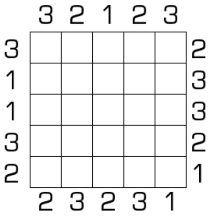

# 123数独

## 规则

| 序号  |  限制区域   | 限制规则                         | 备注  |
|:---:|:-------:|:-----------------------------|:---:|
|  1  |    行    | 填充1~3和两个空格                   | 5 行 |
|  2  |    列    | 填充1~3和两个空格                   | 5 列 |
|  3  | 提示数（盘外） | 提示数`A`：当前位置向盘内看，第一个看到的数是 `A` | 5 列 |

### 标签

- [[数限格]]

## 题库

### 在线题库

- [独·数之道](http://www.sudokufans.org.cn/lx/game.index.php?type=123) 【需要登录】【不保证唯一解】
