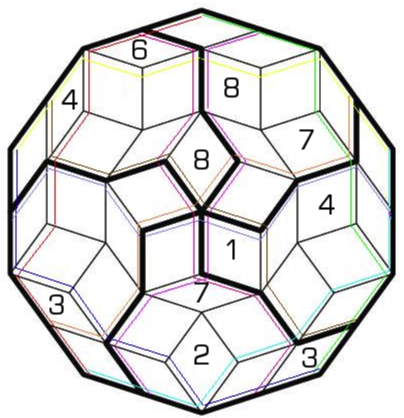

# 五角球数独

## 规则

| 序号  |  限制区域   | 限制规则    |   备注   |
|:---:|:-------:|:--------|:------:|
|  1  |   异形宫   | [1~8填充] | 5 个异形宫 |
|  2  | [共边平行路] | [1~8填充] | 10 条路  |

### 标签

- [[足球]]
- [[五星]]
- [[共边平行路]]

## 题库

### 在线题库

- [独·数之道](http://www.sudokufans.org.cn/lx/5j.index.php) 【需要登录】

[1~8填充]: ../../rules.md#1to8填充

[共边平行路]: ../../rules.md#共边平行路
