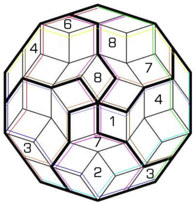

<!-- START doctoc generated TOC please keep comment here to allow auto update -->
<!-- DON'T EDIT THIS SECTION, INSTEAD RE-RUN doctoc TO UPDATE -->
## 目录

- [五角球数独](#%E4%BA%94%E8%A7%92%E7%90%83%E6%95%B0%E7%8B%AC)
  - [目录](#%E7%9B%AE%E5%BD%95)
  - [规则](#%E8%A7%84%E5%88%99)
    - [标签](#%E6%A0%87%E7%AD%BE)
  - [题库](#%E9%A2%98%E5%BA%93)
    - [在线题库](#%E5%9C%A8%E7%BA%BF%E9%A2%98%E5%BA%93)

<!-- END doctoc generated TOC please keep comment here to allow auto update -->

# 五角球数独

## 目录

- [规则](五角球数独.md#规则)
  - [标签](五角球数独.md#标签)
- [题库](五角球数独.md#题库)
  - [在线题库](五角球数独.md#在线题库)

## 规则

|  序号 |                 限制区域                | 限制规则                                  |   备注   |
| :-: | :---------------------------------: | ------------------------------------- | :----: |
|  1  |                 异形宫                 | [1\~8填充](../../rules/rules.md#1to8填充) | 5 个异形宫 |
|  2  | [共边平行路](../../rules/rules.md#共边平行路) | [1\~8填充](../../rules/rules.md#1to8填充) |  10 条路 |

### 标签

- \#足球
- \#五星
- \#共边平行路

## 题库

### 在线题库

- [独·数之道](http://www.sudokufans.org.cn/lx/5j.index.php) 【需要登录】
