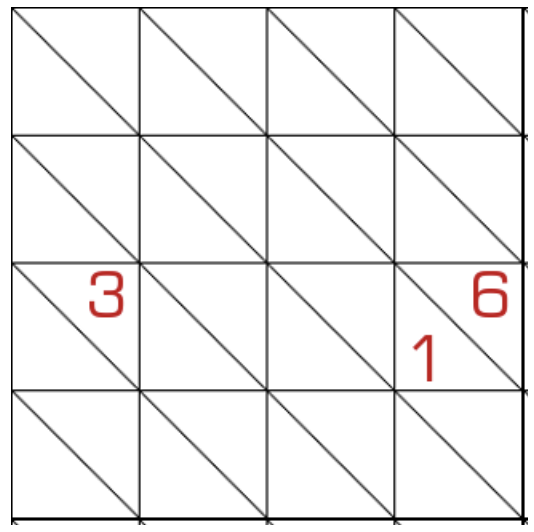

# 半格数独
<!-- START doctoc generated TOC please keep comment here to allow auto update -->
<!-- DON'T EDIT THIS SECTION, INSTEAD RE-RUN doctoc TO UPDATE -->

<!-- END doctoc generated TOC please keep comment here to allow auto update -->

## 规则

| 序号  | 限制区域 | 限制规则             |   备注    |
|:---:|:----:|:-----------------|:-------:|
|  1  |  行   | [1~8填充]          |   4 行   |
|  2  |  列   | [1~8填充]          |   4 列   |
|  3  | 下斜线  | [1~8不重复]         | 8 条下斜线  |
|  4  | 正方形  | 统一正方形中，右上格 > 左下格 | 16 个正方形 |

### 标签

- #比大小

## 题库

### 在线题库

- [独·数之道](http://www.sudokufans.org.cn/lx/game.index.php?type=8t) 【需要登录】【不保证唯一解】

[1~8填充]: ../../rules/rules.md#1to8填充

[1~8不重复]: ../../rules/rules.md#1to8不重复
