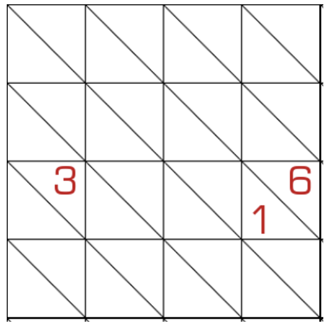

# 半格数独

## 目录

* [规则](半格数独.md#规则)
  * [标签](半格数独.md#标签)
* [题库](半格数独.md#题库)
  * [在线题库](半格数独.md#在线题库)

## 规则

|  序号 | 限制区域 | 限制规则                                    |    备注   |
| :-: | :--: | --------------------------------------- | :-----: |
|  1  |   行  | [1\~8填充](../../rules/rules.md#1to8填充)   |   4 行   |
|  2  |   列  | [1\~8填充](../../rules/rules.md#1to8填充)   |   4 列   |
|  3  |  下斜线 | [1\~8不重复](../../rules/rules.md#1to8不重复) |  8 条下斜线 |
|  4  |  正方形 | 统一正方形中，右上格 > 左下格                        | 16 个正方形 |

### 标签

* \#比大小

## 题库

### 在线题库

* [独·数之道](http://www.sudokufans.org.cn/lx/game.index.php?type=8t) 【需要登录】【不保证唯一解】
