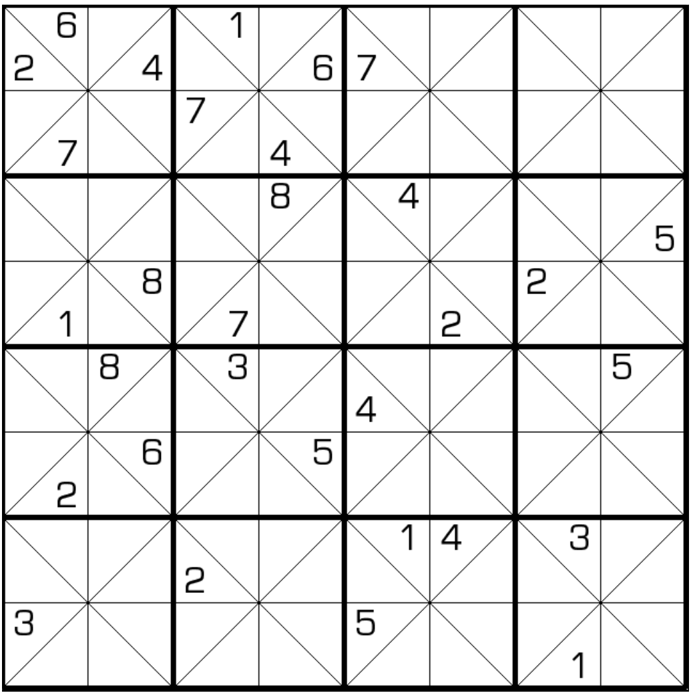

# 围尔数独

## 规则

| 序号  | 限制区域 | 限制规则    |  备注   |
|:---:|:----:|:--------|:-----:|
|  1  |  行   | [1~8填充] |  8 行  |
|  2  |  列   | [1~8填充] |  8 列  |
|  3  |  宫   | [1~8填充] | 16 个宫 |

> 行示例:
> 

## 题库

### 在线题库

- [独·数之道](http://www.sudokufans.org.cn/lx/game.index.php?type=wil) 【需要登录】

[1~8填充]: ../../rules.md#1to8填充
