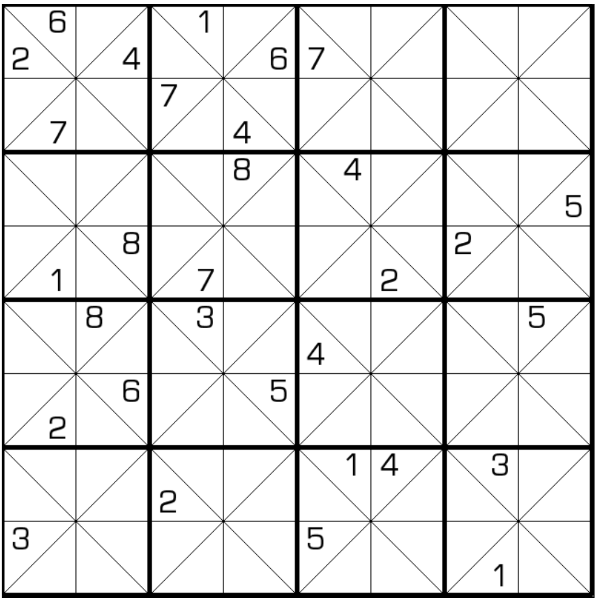

<!-- START doctoc generated TOC please keep comment here to allow auto update -->
<!-- DON'T EDIT THIS SECTION, INSTEAD RE-RUN doctoc TO UPDATE -->
## 目录

- [围尔数独](#%E5%9B%B4%E5%B0%94%E6%95%B0%E7%8B%AC)
  - [目录](#%E7%9B%AE%E5%BD%95)
  - [规则](#%E8%A7%84%E5%88%99)
  - [题库](#%E9%A2%98%E5%BA%93)
    - [在线题库](#%E5%9C%A8%E7%BA%BF%E9%A2%98%E5%BA%93)

<!-- END doctoc generated TOC please keep comment here to allow auto update -->

# 围尔数独

## 目录

- [规则](围尔数独.md#规则)
- [题库](围尔数独.md#题库)
  - [在线题库](围尔数独.md#在线题库)

## 规则

|  序号 | 限制区域 | 限制规则                                  |   备注  |
| :-: | :--: | ------------------------------------- | :---: |
|  1  |   行  | [1\~8填充](../../rules/rules.md#1to8填充) |  8 行  |
|  2  |   列  | [1\~8填充](../../rules/rules.md#1to8填充) |  8 列  |
|  3  |   宫  | [1\~8填充](../../rules/rules.md#1to8填充) | 16 个宫 |

> 行示例: 

## 题库

### 在线题库

- [独·数之道](http://www.sudokufans.org.cn/lx/game.index.php?type=wil) 【需要登录】
