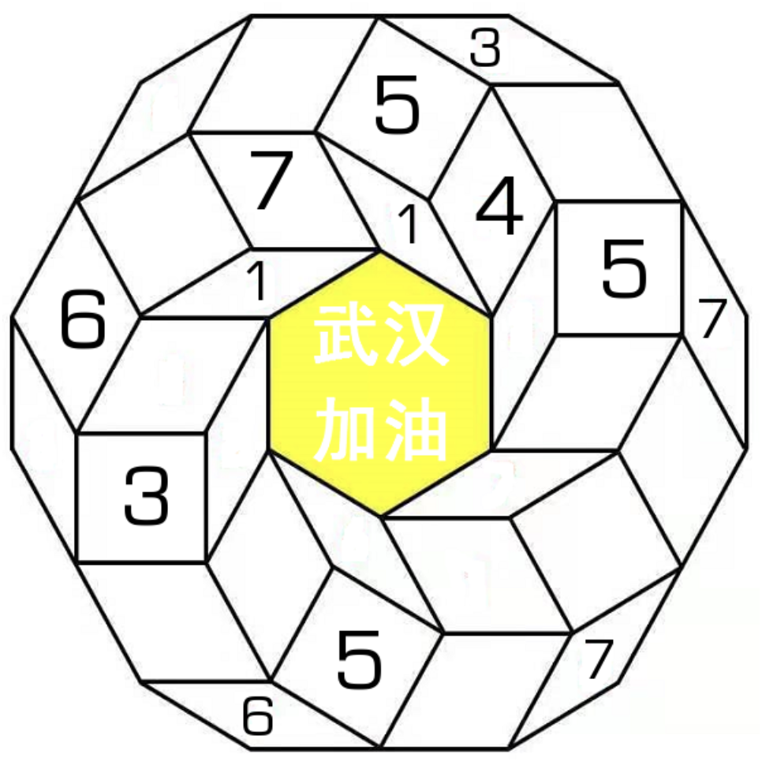

# 折纸数独
<!-- START doctoc generated TOC please keep comment here to allow auto update -->
<!-- DON'T EDIT THIS SECTION, INSTEAD RE-RUN doctoc TO UPDATE -->

<!-- END doctoc generated TOC please keep comment here to allow auto update -->

## 规则

| 序号  |  限制区域   | 限制规则  |  备注  |
|:---:|:-------:|:------|:----:|
|  1  | [共边平行路] | 1~7填充 | 6 条路 |

### 标签

- #共边平行路

## 题库

### 在线题库

- [独·数之道](http://www.sudokufans.org.cn/main.index.php?type=xh4) 【需要登录】

[共边平行路]: ../../rules/rules.md#共边平行路
