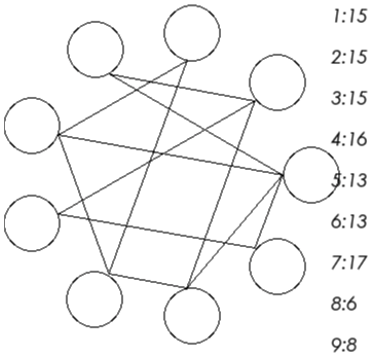

# 规则
| 序号 | 限制区域 | 限制规则 | 备注 |
| :---: | :---: | :--- | :---: |
| 1 | 全盘 | [1~9填充] |  |
| 2 | 提示数（盘外） | 提示数`A:S`：填好盘面后，与`A`相连的所有数的和 = S | 9 组提示数 |

# 题库

## 在线题库
- [独·数之道](http://www.sudokufans.org.cn/lx/tl.index.php) 【需要登录】

[1~9填充]: ../../rules.md#1~9填充