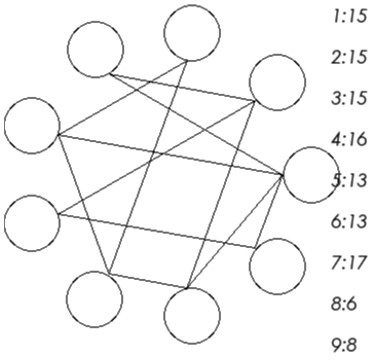

# 推理数独

## 目录

* [规则](推理数独.md#规则)
  * [标签](推理数独.md#标签)
* [题库](推理数独.md#题库)
  * [在线题库](推理数独.md#在线题库)

## 规则

|  序号 |   限制区域  | 限制规则                                  |   备注   |
| :-: | :-----: | ------------------------------------- | :----: |
|  1  |    全盘   | [1\~9填充](../../rules/rules.md#1to9填充) |        |
|  2  | 提示数（盘外） | 提示数`A:S`：填好盘面后，与`A`相连的所有数的和 = S       | 9 组提示数 |

### 标签

* \#计算/加法

## 题库

### 在线题库

* [独·数之道](http://www.sudokufans.org.cn/lx/tl.index.php) 【需要登录】
