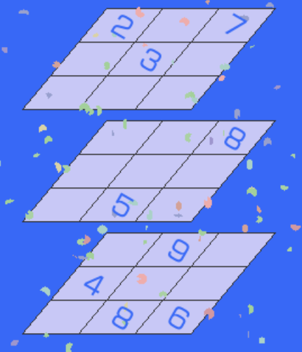

# 3阶立体数独

## 规则

| 序号  | 限制区域 | 限制规则    |  备注  |
|:---:|:----:|:--------|:----:|
|  1  | 正视面  | [1~9填充] | 3 个面 |
|  2  | 左视面  | [1~9填充] | 3 个面 |
|  3  | 俯视面  | [1~9填充] | 3 个面 |

### 标签

- [[立体]]

## 题库

### 在线题库

- [独·数之道](http://www.sudokufans.org.cn/lx/3d3.index.php) 【需要登录】

[1~9填充]: ../../rules.md#1to9填充
