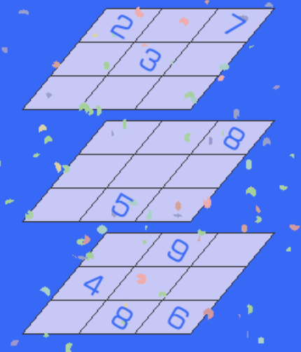

# 3 阶立体数独

## 目录

* [规则](3阶立体数独.md#规则)
  * [标签](3阶立体数独.md#标签)
* [题库](3阶立体数独.md#题库)
  * [在线题库](3阶立体数独.md#在线题库)

## 规则

|  序号 | 限制区域 | 限制规则                                  |  备注  |
| :-: | :--: | ------------------------------------- | :--: |
|  1  |  正视面 | [1\~9填充](../../rules/rules.md#1to9填充) | 3 个面 |
|  2  |  左视面 | [1\~9填充](../../rules/rules.md#1to9填充) | 3 个面 |
|  3  |  俯视面 | [1\~9填充](../../rules/rules.md#1to9填充) | 3 个面 |

### 标签

* \#立体

## 题库

### 在线题库

* [独·数之道](http://www.sudokufans.org.cn/lx/3d3.index.php) 【需要登录】
