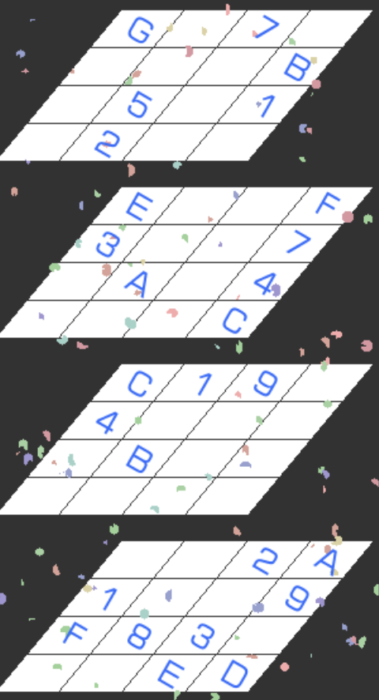

# 4阶立体数独
<!-- START doctoc generated TOC please keep comment here to allow auto update -->
<!-- DON'T EDIT THIS SECTION, INSTEAD RE-RUN doctoc TO UPDATE -->

<!-- END doctoc generated TOC please keep comment here to allow auto update -->

## 规则

| 序号  | 限制区域 | 限制规则    |  备注  |
|:---:|:----:|:--------|:----:|
|  1  | 正视面  | [1~G填充] | 4 个面 |
|  2  | 左视面  | [1~G填充] | 4 个面 |
|  3  | 俯视面  | [1~G填充] | 4 个面 |

### 标签

- #立体

## 题库

### 在线题库

- [独·数之道](http://www.sudokufans.org.cn/lx/3d4.index.php) 【需要登录】

[1~G填充]: ../../rules/rules.md#1toG填充
